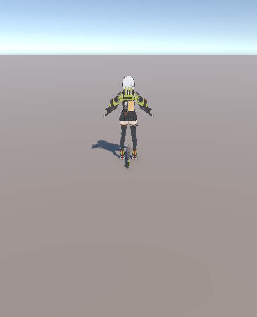
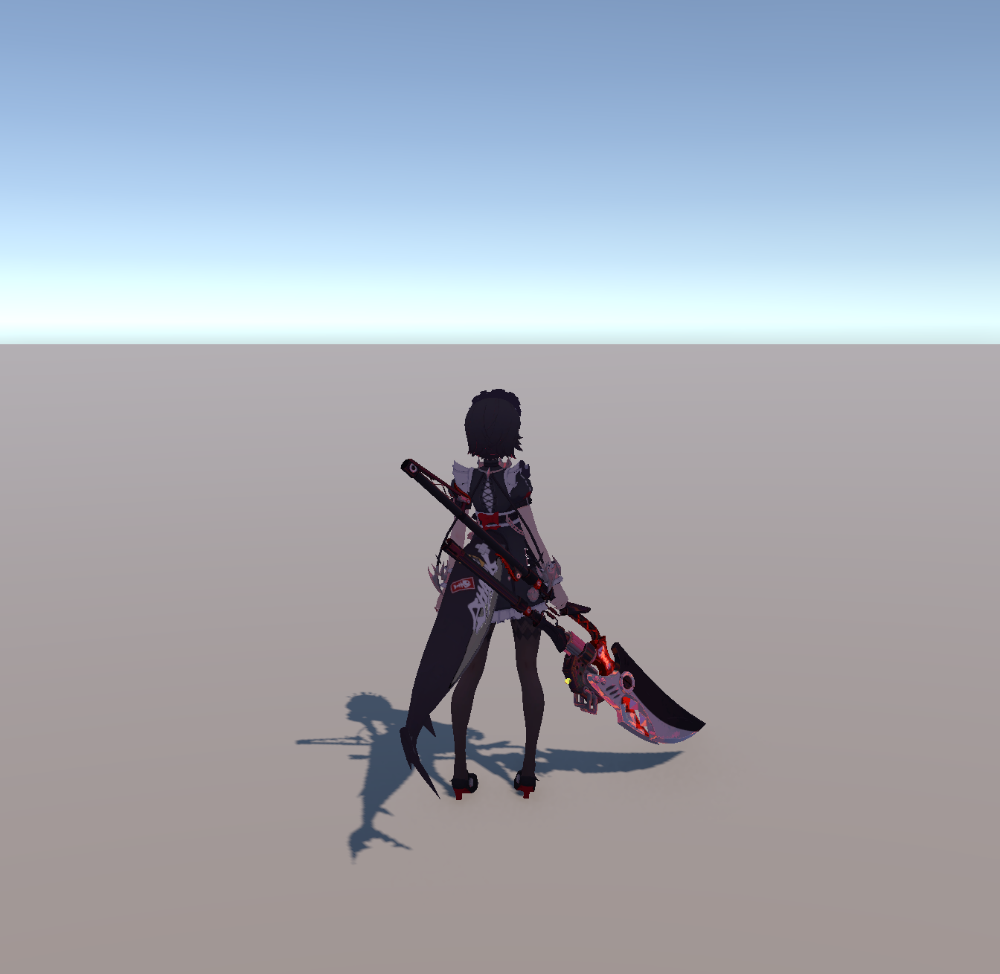

# Compete

基于 Unity 6 的 3D 动作格斗游戏 Demo，包含连招战斗、血条 UI、音效、特效与镜头系统。

## 截图





## 功能特性

- **连招战斗系统**：基于状态机的连招框架（移动/攻击/技能状态），支持连招配置数据驱动（ScriptableObject + Luban）
- **角色系统**：角色数据资产（PlayerSO）、移动控制基类、角色名列表
- **血条 UI**：世界空间血条（WorldSpace Health Bar），MVVM 式数据绑定
- **音效系统**：AudioManager + 音频混合器控制，支持 3D 空间音效与角色音效组件
- **特效系统**：VFX 管理器 + 对象池（VFX_PoolManager）
- **镜头系统**：Cinemachine 摄像机，含玩家镜头回正
- **移动端支持**：Input System，支持手机触控操作
- **事件中心**：EventCenter 解耦系统间通信

## 技术栈

| 类别 | 技术 |
| ---- | ---- |
| 引擎 | Unity 6000.4.0f1 (Unity 6) |
| 渲染 | URP (Universal Render Pipeline) |
| 动画 | Animancer |
| 输入 | Input System |
| 网络 | Unity Netcode for GameObjects + UOS KCP 传输 |
| 配置 | Luban |
| 镜头 | Cinemachine |
| 其他 | DOTween、MagicaCloth V2、Behavior Designer |

## 项目结构

```
Assets/
├── script/          # 游戏脚本
│   ├── data/        # 数据资产（连招、移动、音效等）
│   ├── player/      # 角色控制与角色数据
│   ├── sound/       # 音效系统
│   ├── ui/          # 血条 UI
│   ├── vfx/         # 特效与对象池
│   ├── 状态机/       # 状态机与连招状态
│   ├── 单例/         # 单例基类
│   └── 事件/         # 事件中心
├── Scenes/          # 场景（SampleScene）
├── Resource/        # 音频资源
├── Screenshots/     # 开发截图
└── plugins/         # 第三方插件（Animancer 等）
```

## 运行方式

1. 安装 [Unity 6000.4.0f1](https://unity.com/releases/editor/whats-new/6000.4.0)
2. 用 Unity Hub 打开本仓库目录
3. 打开 `Assets/Scenes/SampleScene.unity`
4. 点击 Play 运行

## 依赖

- 需要联网拉取 UPM 包：UOS KCP 传输、Luban、unity-mcp 等（见 `Packages/manifest.json`）
- 第三方插件 Animancer 已随仓库包含在 `Assets/plugins/` 下
